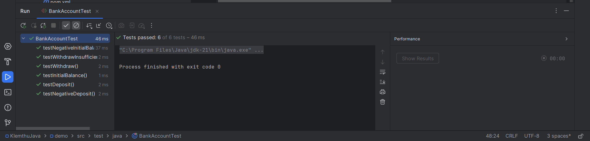

# Mô tả mã nguồn

1. Tên file: BankAccount.java
   Mã nguồn bao gồm một lớp tên là BankAccount với các chức năng chính:

2. Các thành phần chính

- Thuộc tính:

 balance: Số dư tài khoản (kiểu double).

- Phương thức:
```
.BankAccount(double initialBalance):
 Constructor khởi tạo tài khoản với số dư ban đầu.
 Ném ngoại lệ nếu số dư ban đầu là số âm. 
 
.deposit(double amount):
 Thêm tiền vào tài khoản.
 Ném ngoại lệ nếu số tiền gửi <= 0. 
 
 .withdraw(double amount):
 Rút tiền từ tài khoản.
 Ném ngoại lệ nếu số tiền rút lớn hơn số dư hoặc <= 0. 
 
 .getBalance():
 Trả về số dư hiện tại. 
```
3. Ví dụ mã nguồn:


```java
public class BankAccount {
private double balance;

    public BankAccount(double initialBalance) {
        if (initialBalance < 0) {
            throw new IllegalArgumentException("Initial balance cannot be negative.");
        }
        this.balance = initialBalance;
    }

    public void deposit(double amount) {
        if (amount <= 0) {
            throw new IllegalArgumentException("Deposit amount must be positive.");
        }
        balance += amount;
    }

    public void withdraw(double amount) {
        if (amount <= 0) {
            throw new IllegalArgumentException("Withdraw amount must be positive.");
        }
        if (amount > balance) {
            throw new IllegalArgumentException("Insufficient balance.");
        }
        balance -= amount;
    }

    public double getBalance() {
        return balance;
    }
}
```
# Mô tả mã kiểm thử

- Tên file: BankAccountTest.java
- Mã kiểm thử được viết bằng JUnit 5, tập trung vào kiểm tra tính đúng đắn của từng phương thức trong lớp BankAccount.

1. Các bài kiểm thử:
- testInitialBalance: Kiểm tra số dư ban đầu khi tạo tài khoản.
- testDeposit: Kiểm tra phương thức deposit khi gửi tiền hợp lệ.
- testWithdraw: Kiểm tra phương thức withdraw khi rút tiền hợp lệ.
- testWithdrawInsufficientBalance: Kiểm tra rút tiền vượt số dư.
- testNegativeDeposit: Kiểm tra gửi tiền giá trị âm.
- testNegativeInitialBalance: Kiểm tra khởi tạo tài khoản với số dư âm.

2. Ví dụ mã kiểm thử:

```java
import org.junit.jupiter.api.Test;
import static org.junit.jupiter.api.Assertions.*;

public class BankAccountTest {

    @Test
    public void testInitialBalance() {
        BankAccount account = new BankAccount(1000);
        assertEquals(1000, account.getBalance(), "Initial balance should be 1000.");
    }

    @Test
    public void testDeposit() {
        BankAccount account = new BankAccount(1000);
        account.deposit(500);
        assertEquals(1500, account.getBalance(), "Balance after deposit should be 1500.");
    }

    @Test
    public void testWithdraw() {
        BankAccount account = new BankAccount(1000);
        account.withdraw(300);
        assertEquals(700, account.getBalance(), "Balance after withdrawal should be 700.");
    }

    @Test
    public void testWithdrawInsufficientBalance() {
        BankAccount account = new BankAccount(1000);
        Exception exception = assertThrows(IllegalArgumentException.class, () -> {
            account.withdraw(1500);
        });
        assertEquals("Insufficient balance.", exception.getMessage());
    }

    @Test
    public void testNegativeDeposit() {
        BankAccount account = new BankAccount(1000);
        Exception exception = assertThrows(IllegalArgumentException.class, () -> {
            account.deposit(-500);
        });
        assertEquals("Deposit amount must be positive.", exception.getMessage());
    }

    @Test
    public void testNegativeInitialBalance() {
        Exception exception = assertThrows(IllegalArgumentException.class, () -> {
            new BankAccount(-100);
        });
        assertEquals("Initial balance cannot be negative.", exception.getMessage());
    }
}
```

# Kết quả chạy kiểm thử
- Khi chạy kiểm thử bằng  IDE (IntelliJ IDEA), bài kiểm thử sẽ được thực thi. Dưới đây là kết quả mẫu khi tất cả bài kiểm thử đều thành công.

- Cách chạy kiểm thử bằng IDE: 

 +, Nhấp chuột phải vào file BankAccountTest và chọn Run Tests.

 +, Kết quả đầu ra

```
[INFO] Running BankAccountTest
[INFO] Tests run: 6, Failures: 0, Errors: 0, Skipped: 0
[INFO] BUILD SUCCESS
```

# Cấu Trúc Hệ Thống 

```
.
├── src
│   ├── main
│   │   └── java
│   │       └── BankAccount.java
│   └── test
│       └── java
│           └── BankAccountTest.java
├── pom.xml
└── README.md
```

# Kết Quả 
